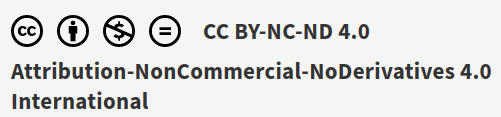

\pagebreak

> AVISO: El texto contiene muchos enlaces embebidos que sólo funcionan si se abre el PDF desde un lector digital. Si se imprime, se perderá mucha información interesante. No obstante, en el apartado "Bibliografía" se han añadido los enlaces para aquellos lectores que deseen una copia impresa y puedan ver la información. 

---

Este documento se encuentra bajo una licencia Creative Commons de Atribución-CompartirIgual (CC BY-SA). 



Esto significa que puedes:

- Compartir: copiar y redistribuir el material en cualquier medio o formato.
- Adaptar: remezclar, transformar y construir sobre el material para cualquier propósito, incluso comercialmente.

Bajo las siguientes condiciones:

- Atribución: debes dar crédito de manera adecuada, proporcionar un enlace a la licencia e indicar si se han realizado cambios. Puedes hacerlo de cualquier manera razonable, pero no de una manera que sugiera que el licenciante te respalda a ti o al uso que hagas del trabajo.
- Compartir igual: si remezclas, transformas o creas a partir del material, debes distribuir tus contribuciones bajo la misma licencia que el original.

Para más detalles, consulta la [licencia completa](https://creativecommons.org/licenses/by-sa/4.0/legalcode.es).

---

> Para una versión actualizada de este libro visita esta Web: <https://gitlab.iesvirgendelcarmen.com/juangu/adt07-flask-mongo-praetorian-reservas>.


\pagebreak
\tableofcontents
\pagebreak


# Desarrollo de Aplicaciones con Bases de Datos Documentales

Las bases de datos documentales son un tipo de sistema de gestión de bases de datos (SGBD) que se centra en el almacenamiento y recuperación de datos en formato de documentos. En lugar de organizar la información en tablas como en las bases de datos relacionales, las bases de datos documentales utilizan documentos, que pueden ser en formatos como JSON (JavaScript Object Notation) o BSON (Binary JSON). Cada documento puede contener datos estructurados y no estructurados, lo que proporciona flexibilidad en la representación de la información.

Mientras que las bases de datos relacionales están más recomendadas a casos en los que hay mucha rotación de datos, las documentales se recomiendan para los casos donde hay pocas o nulas actualizaciones.

Características comunes de las bases de datos documentales:

1. **Documentos:** La unidad básica de almacenamiento es el documento, que puede contener datos en formato clave-valor, matrices, objetos anidados, etc.

2. **Esquema dinámico:** A diferencia de las bases de datos relacionales, las bases de datos documentales permiten esquemas dinámicos, lo que significa que cada documento en la colección puede tener diferentes campos.

3. **Flexibilidad:** Son adecuadas para datos semiestructurados y no estructurados, lo que facilita el almacenamiento de información variada y cambiante.

4. **Escalabilidad horizontal:** Muchas bases de datos documentales están diseñadas para escalar horizontalmente, distribuyendo la carga de trabajo en varios servidores para manejar grandes volúmenes de datos y tráfico.

5. **Consultas eficientes:** Permiten realizar consultas eficientes utilizando índices en los campos clave.

Ejemplos de bases de datos documentales:

1. **MongoDB:** Es una de las bases de datos documentales más populares y ampliamente utilizadas. Almacena datos en formato BSON (una representación binaria de JSON) y permite esquemas flexibles.

2. **Firebase Firestore:** Es una base de datos documental en la nube proporcionada por Firebase, que es parte de Google Cloud Platform. Almacena datos en formato JSON y es especialmente popular para aplicaciones web y móviles.


**Tipos de BBDD NoSQL:**

* Basados en columnas
    * Permite más facilidad para hacer medias, varianza, etc.
* Clave-valor
    * como en la base de datos Redis o JSON
* Tripletes de
    * el objeto que describes
    * relaciones con otros objetos
    * valor
* Documentos
    * JSON
    * XML
    * BLOB
        * texto

**MongoDB**

Mongo es una base de datos documental NoSQL (Not Only SQL) organizada en bases de datos como las bases de datos de MySQL o algo similar a los Schemas de Oracle
A su vez las bases de datos se organizan en colecciones lo que en relacional serían las tablas.

Mongo está muy relacionado con el mundo JavaScript y NodeJS porque la información que almacena y gestiona está en formato JSON.

## Repaso JSON

Recordamos que JSON (JavaScript Object Notation) es un objeto JavaScript con el formato:

```js
{ clave: "valor" }
```

**Ejemplo**: Imagina que quieres almacenar una "persona", pues un ejemplo de este objeto sería así:

```js
{
 "Nombre":"John",
 "Apellidos":"Doe",
 "DNI":"12345678Z",
 "FechaNac": "01-01-1980",
 "Sexo": "V"
}
```

## JSON Schema

Si podemos crear una base de datos con documentos en cualquier formato y cualquier esquema, la programación se nos puede complicar. 

Por suerte disponemos de herramientas como JSON Schema que nos permite "moldear" los documentos. Para el ejemplo anterior la sintaxis de un JSON Schema define los diferentes campos que una persona tendría sería así:

```js
{
    "$schema": "http://json-schema.org/draft-04/schema#",
    "description": "A representation of a person, company, organization, or place",
    "type": "object",
    "required": ["familyName", "givenName"],
    "properties": {
        "fn": {
            "description": "Formatted Name",
            "type": "string"
        },
        "familyName": { "type": "string" },
        "givenName": { "type": "string" },
        "additionalName": { "type": "array", "items": { "type": "string" } },
        "honorificPrefix": { "type": "array", "items": { "type": "string" } },
        "honorificSuffix": { "type": "array", "items": { "type": "string" } },
        "nickname": { "type": "string" },
        "url": { "type": "string", "format": "uri" },
        "email": {
            "type": "object",
            "properties": {
                "type": { "type": "string" },
                "value": { "type": "string", "format": "email" }
            }
        },
        "tel": {
            "type": "object",
            "properties": {
                "type": { "type": "string" },
                "value": { "type": "string", "format": "phone" }
            }
        },
        "adr": { "$ref": "http://json-schema.org/address" },
        "geo": { "$ref": "http://json-schema.org/geo" },
        "tz": { "type": "string" },
        "photo": { "type": "string" },
        "logo": { "type": "string" },
        "sound": { "type": "string" },
        "bday": { "type": "string", "format": "date" },
        "title": { "type": "string" },
        "role": { "type": "string" },
        "org": {
            "type": "object",
            "properties": {
                "organizationName": { "type": "string" },
                "organizationUnit": { "type": "string" }
            }
        }
    }
}
```

Así, cuando en MongoDB veas referencia a un `schema` ya sabes de donde viene el tema. Cuando insertamos objectos, para optimizar la búsqueda e inserción de datos, Mongo va creando y actualizando los esquemas.

\pagebreak